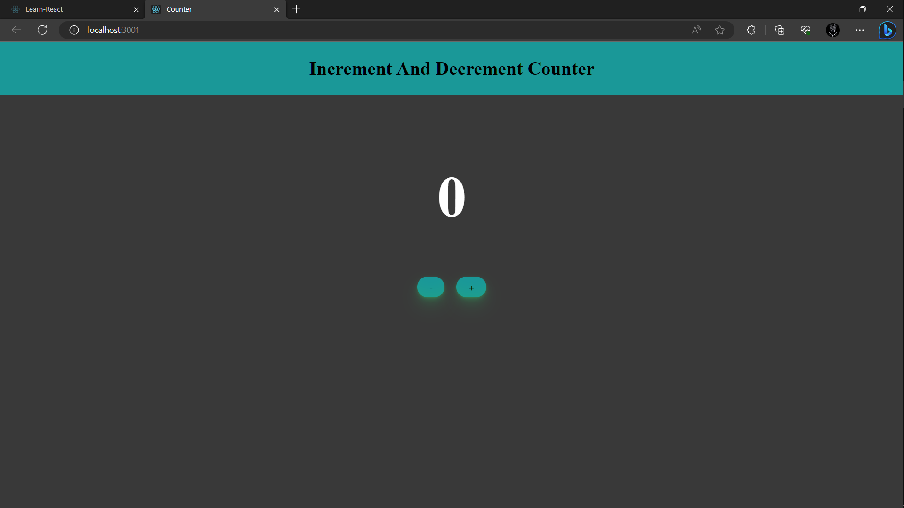

## Available Scripts

In the project directory, you can install Node_Modules:

### `npm install`

In the project directory, you can run:

### `npm start`

Runs the app in the development mode.\
Open [http://localhost:3000](http://localhost:3000) to view it in your browser.

The page will reload when you make changes.\
You may also see any lint errors in the console.

## Movies Review App

# `DEMO :`

## First Look :

---

### Author Links

👋 Hello, I'm Rahul Saini.

🚀 Follow Me:

- [Twitter](https://twitter.com/rahumeetawa)
- [LinkedIn](https://www.linkedin.com/in/rahulmeetawa/)
- [Website](https://meetawa.github.io/)

---
